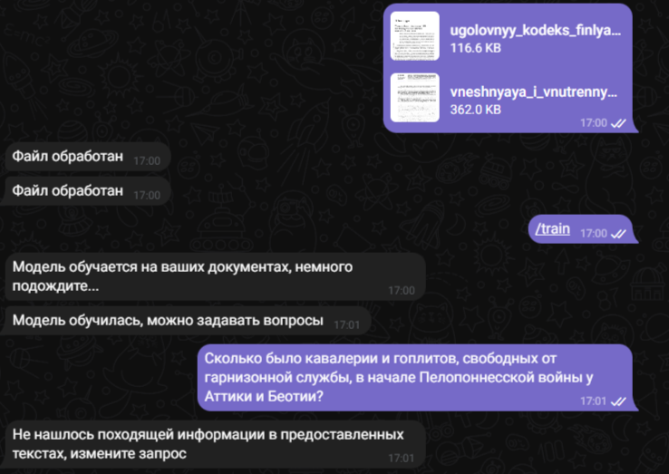
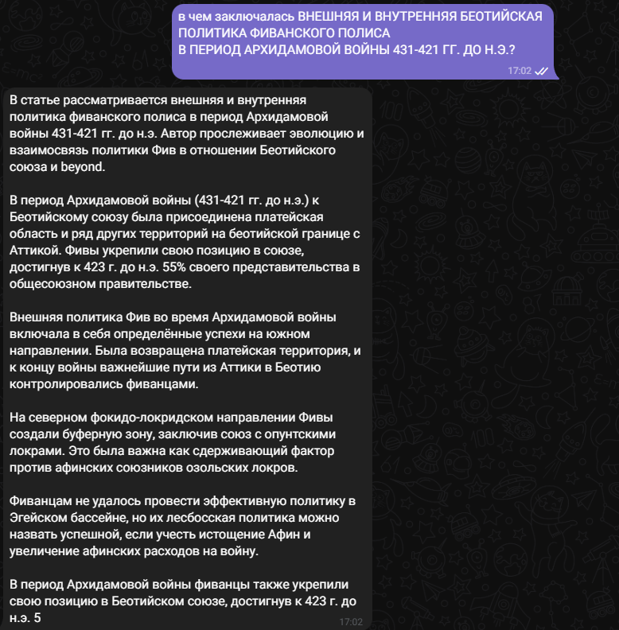

# https://t.me/RRAG_bot
## RAG (Retrieval Augmented Generation) в боте телеграмм
### Основные команды бота:
+ **/start** - основная информация
+ **/help** - помощь по командам
+ **/train** - обучение модели после того, как пользователь отправил документы для обработки
+ **/delete_all_files** - удаление всех отправленных пользователем документов
+ **/check_texts** - позволяет посмотреть сколько файлов успешно прошли обработку

 

    

        
    

    

        
    

